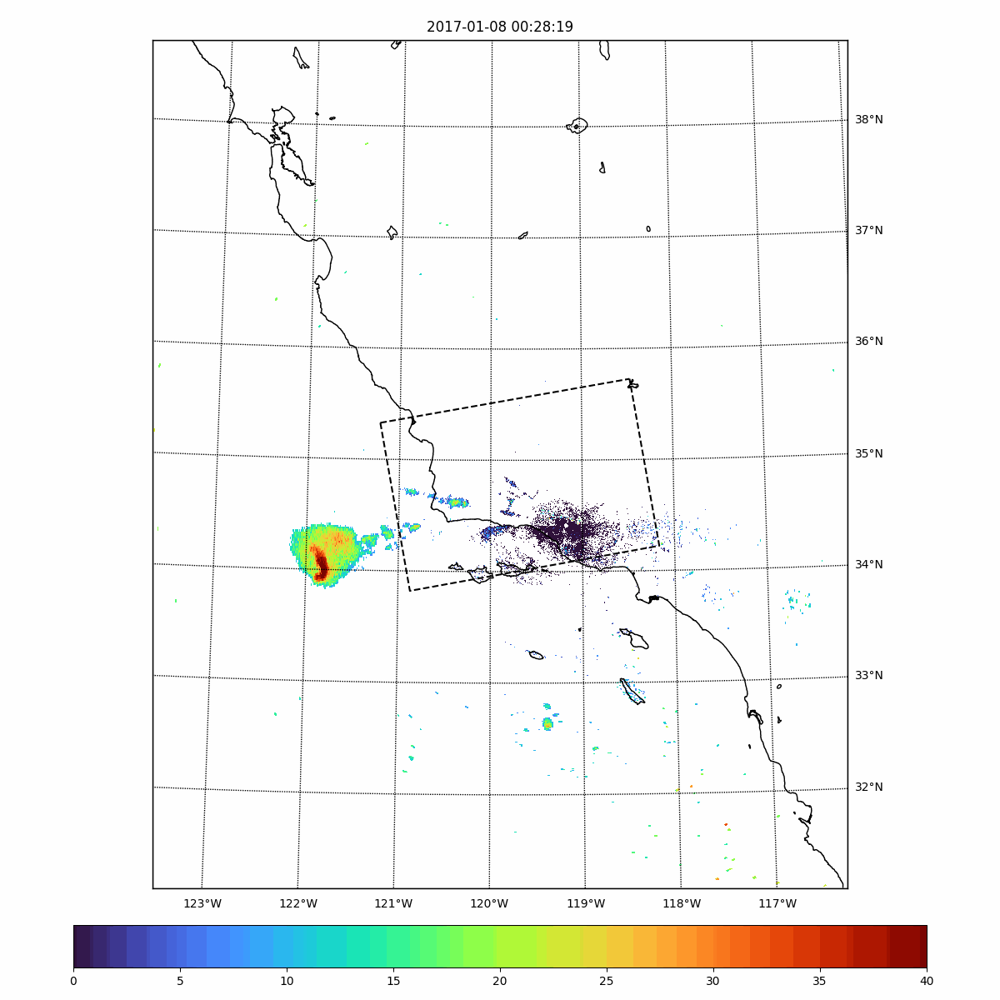
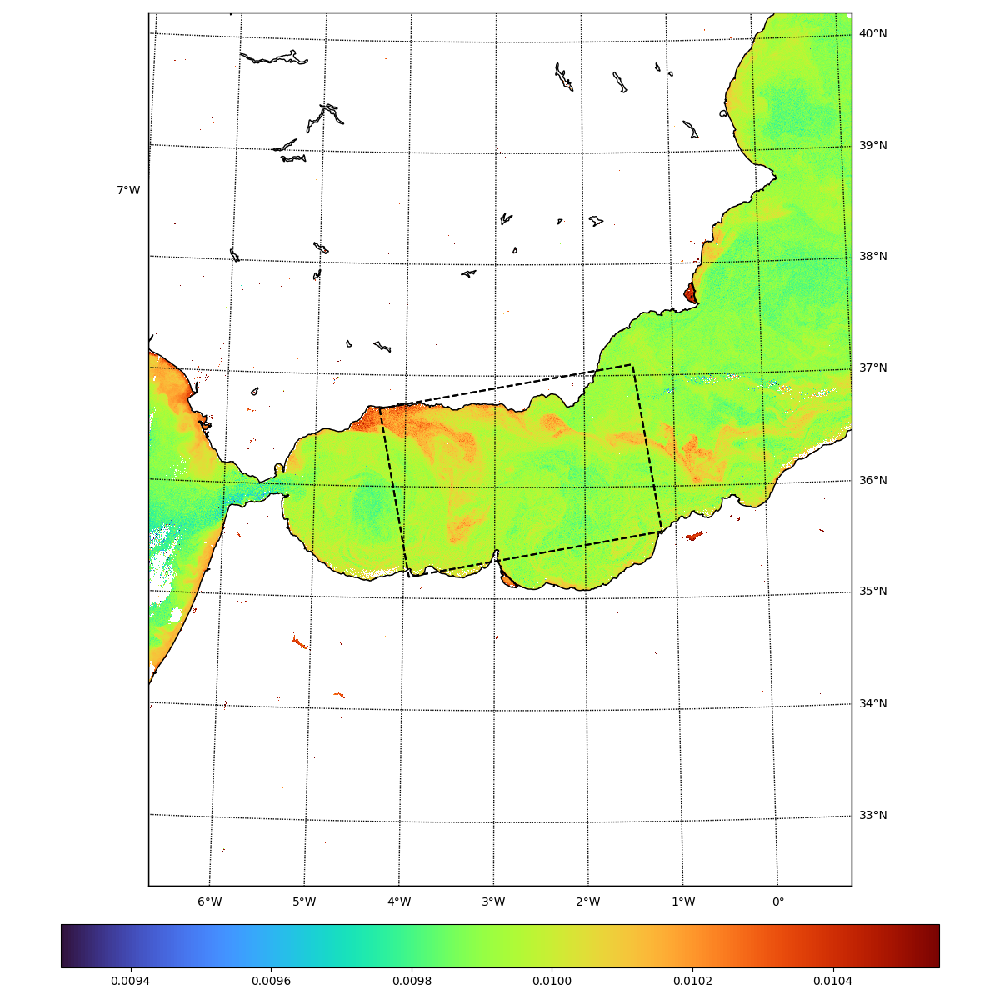
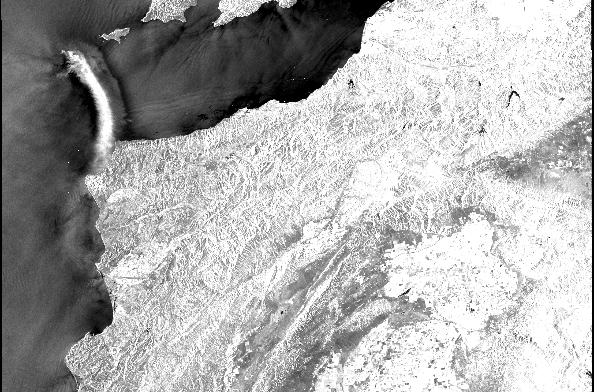
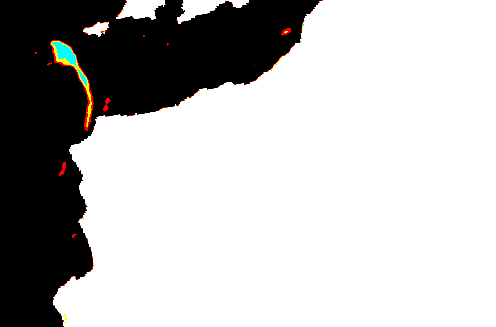
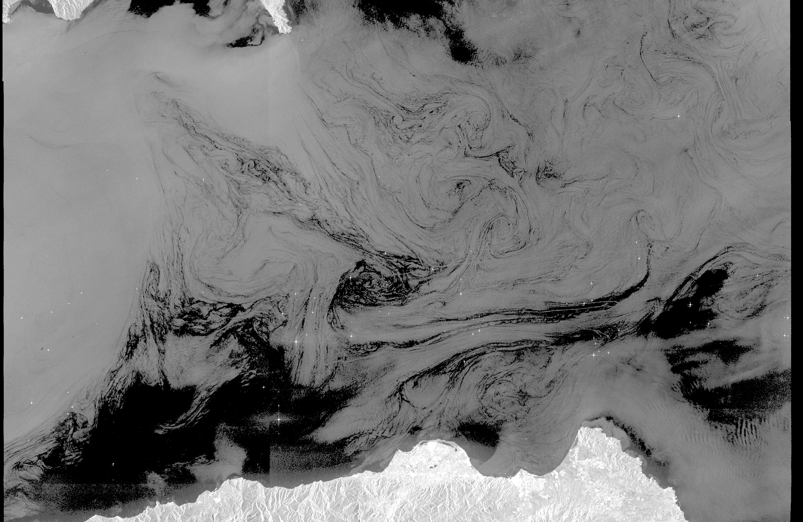
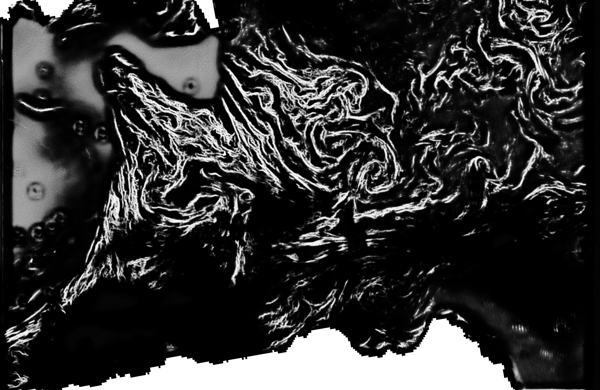

# Notebooks

Link to notebooks presenting colocations with Sentinel-1:

- [NEXRAD L2 Reflectivity](readme/readme_nexrad.ipynb)
- [GOES16/17/18 & Himawari 8/9 ABI L2](readme/readme_abi.ipynb)
- [GOES16/17/18 & Himawari 8/9 RRQPEF L2](readme/readme_rrqpe.ipynb)
- [GOES16/17/28 GLM L2 Events](readme/readme_glm.ipynb)
- [Sentinel3 A/B OLCI](readme/readme_s3.ipynb)
- [Sentinel1 Rain & Biological Slicks](readme/readme_dl.ipynb)

These notebooks have been generated on Google Colab.

# Examples

Here the list of the commands used in these notebooks:

## NEXRAD L2 Reflectivity
```
python colocalize.py    20170108t015819 --platform_key nexrad --gif True
```



## GOES16/17/18 & Himawari 8/9 ABI L2

```
python colocalize.py    20210913t092920 --platform_key abi --channel C14 --gif True
```


## GOES16/17/18 & Himawari 8/9 RRQPEF L2

```
python colocalize.py    20210913t092920 --platform_key rrqpef --gif True
```


## GOES16/17/28 GLM L2 Events

```
python colocalize.py    20200827t000933 --platform_key glm --gif True
```


## Sentinel3 A/B OLCI

```
python colocalize_s3.py 20180117T180947
```



Be carefull that it need a logs.json with credentials.

## Sentinel1 Deep Learning Models

```
! python process_s1.py {asf_username} {asf_password} "20170108t015819" NEXRAD
```




```
! python process_s1.py {asf_username} {asf_password} "20180117t180947" BiologicalSlicks
```



