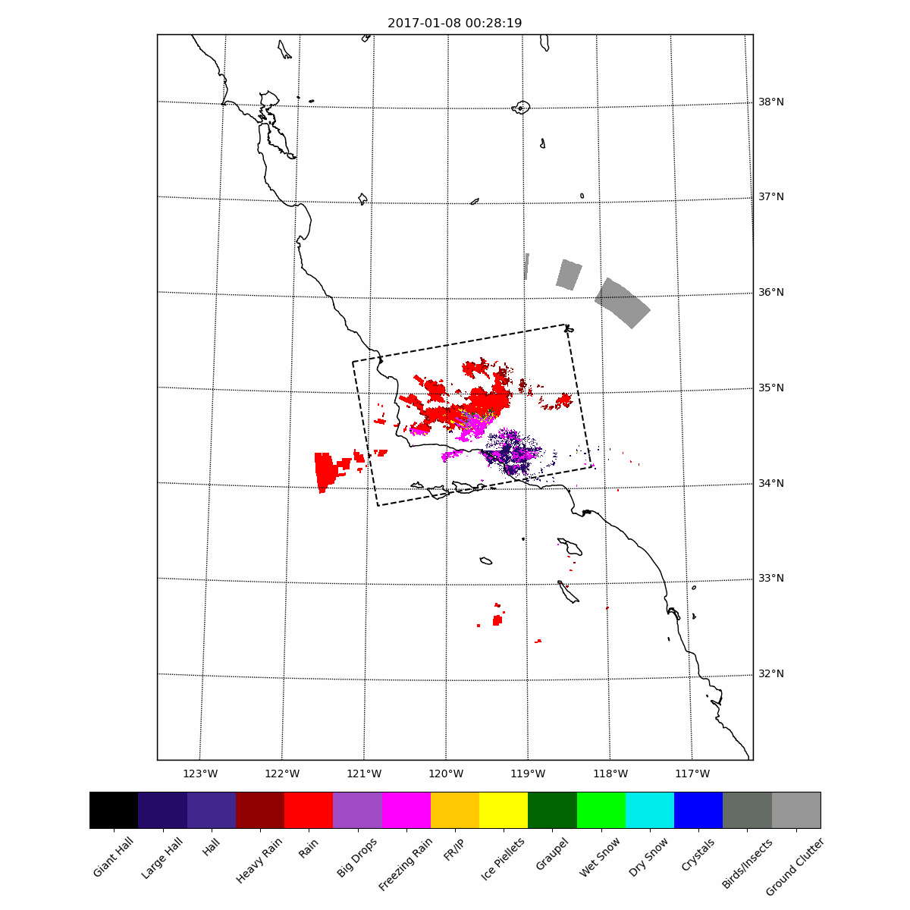
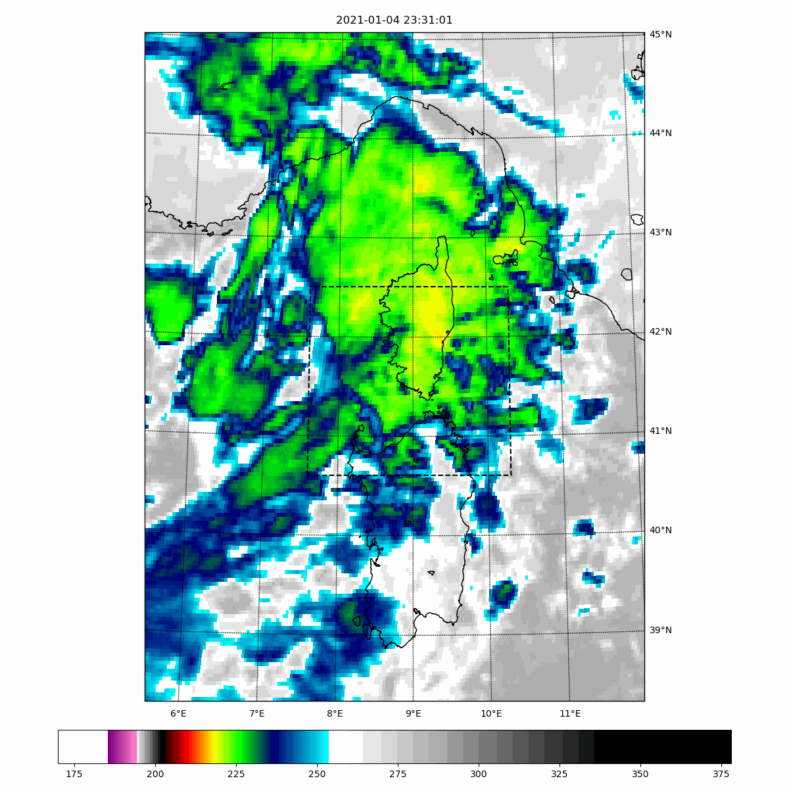
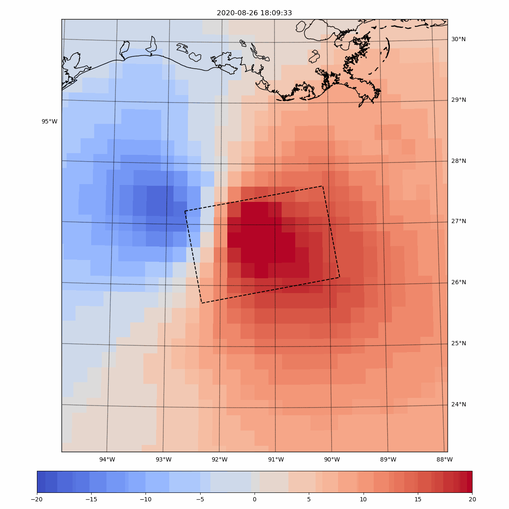

# Table of Content

1. [Table of Content](#table-of-content)
2. [Notebooks](#notebooks)
3. [Examples](#examples)
    1. [NEXRAD L2 Reflectivity](#nexrad_l2_reflectivity)
    2. [NEXRAD L3 Hydrometeor Classification](#nexrad-l3-hydrometeor-classification)
    3. [GOES16/17/18 & Himawari 8/9 ABI L2](#goes16/17/18-&-himawari-8/9-abi-l2)
    4. [GOES16/17/18 & Himawari 8/9 RRQPEF L2](#goes16/17/18-&-himawari-8/9-rrqpef-l2)
    5. [GOES16/17/28 GLM L2 Events](#goes16/17/18-glm-g2-events)
    6. [MSG Seviris](#msg-seviris)
    6. [ERA5 Wind Speed](#era5-wind-speed)
    7. [Sentinel3 A/B OLCI](#sentinel3-a/b-olci)
    8. [Sentinel1 Deep Learning Models](#sentinel1-deep-learning-models)
4. [Usage details](#usage_details)
    1. Arguments for zone/time selection
    2. Arguments for the sensor selection
    3. Logins
    

# Notebooks

Link to notebooks presenting colocations with Sentinel-1:

- [NEXRAD L2 Reflectivity](readme/readme_nexrad.ipynb)
- [NEXRAD L3 DPR/N0M/N0H](readme/readme_nexrad_l3.ipynb)
- [GOES16/17/18 & Himawari 8/9 ABI L2](readme/readme_abi.ipynb)
- [MSG 1&2 SEVIRIS 10.8 µm](readme/readme_seviris.ipynb)
- [ERA5](readme/readme_era5.ipynb)
- [GOES16/17/18 & Himawari 8/9 RRQPEF L2](readme/readme_rrqpe.ipynb)
- [GOES16/17/28 GLM L2 Events](readme/readme_glm.ipynb)
- [Sentinel3 A/B OLCI](readme/readme_s3.ipynb)
- [Sentinel1 Rain & Biological Slicks](readme/readme_dl.ipynb)

These notebooks have been generated on Google Colab.

# Examples

Here the list of the commands used in these notebooks:

## NEXRAD L2 Reflectivity
```
python colocalize.py 20170108t015819 --data NEXRAD_L2 --create_gif True
```


## NEXRAD L3 Hydrometeor Classification

```
python colocalize_nexrad_l3.py 20170108t015819 --channel HHC --create_gif True
```



## GOES16/17/18 & Himawari 8/9 ABI L2

```
python colocalize.py 20210913t092920 --data ABI --channel C14 --create_gif True
```




## GOES16/17/18 & Himawari 8/9 RRQPEF L2

```
python colocalize.py 20210913t092920 --data RRQPEF --create_gif True
```


## GOES16/17/28 GLM L2 Events

```
python colocalize.py 20200827t000933 --data GLM --create_gif True
```


## MSG Seviris

```
with open('seviris.txt', 'w') as file:
    file.write('test\t20210105T010101\t40.6\t7.6\t40.6\t10.3\t42.5\t10.3\t42.5\t7.6')

python colocalize_seviris.py --requests_filename seviris.txt --create_gif True
```


## ERA5 Wind Speed

```
python colocalize.py 20200827t000933 --data ERA5 --channel northward_wind_at_10_metres --create_gif True --time_step 60 --max_timedelta 360
```



## Sentinel3 A/B OLCI

```
python colocalize_s3.py 20180117T180947
```


## Sentinel1 Deep Learning Models

```
! python process_s1.py 20170108t015819 NEXRAD
```


```
! python process_s1.py BiologicalSlicks --key 20180117t180947 
```


# Usage details

## Arguments for zone/time selection

The collocation scripts can be called on SAR products. In that case, the ISO datetime should be given as the first argument. By default, the programs will consider it to be a IW-VV and search in the `res/listing_[IW][VV].zip` file. It currently contains only from 2015-01-01 to 2021-12-31.
EW-VV are also supported. In this case, `--sensor_operational_mode` should be set to `EW`.

It is possible to run the program for multiple collocations with the `sentinel1_keys_filename` and `--requests_filename` arguments. The first one will read a file containing the ISO datetime on each line. The second a file where each line is `key ISO_datetime lat1 lon1 lat2 lon2 lat3 lon3 lat4 lon4` (separated by tabulations). 
For example, the following block will run collocation betwen NEXRAD and ERA5:

```
with open('foo.txt', 'w') as file:
    file.write("GLM_NEXRAD_ERA5_20210101T000000\t20210101T000000\t22.52\t-83.97\t22.52\t-79.43\t26.67\t-79.43\t26.67\t-83.97\n")
    file.write("GLM_NEXRAD_ERA5_20210101T010000\t20210101T010000\t22.52\t-83.97\t22.52\t-79.43\t26.67\t-79.43\t26.67\t-83.97\n")
    file.write("GLM_NEXRAD_ERA5_20210101T020000\t20210101T020000\t22.52\t-83.97\t22.52\t-79.43\t26.67\t-79.43\t26.67\t-83.97\n")
    
os.system("python colocalize.py --requests_filename foo.txt --data NEXRAD_L2 --create_gif False --delta_factor 0 --verbose 1")
os.system("python colocalize.py --requests_filename foo.txt --data ERA5 --channel eastward_wind_at_10_metres --create_gif False --delta_factor 0 --verbose 1")
```
will create collocations between NEXRAD and ERA5 on a square centered on KBYX.

Collocation with Sentinel3 only supports collocation with either a single ISO datetime or a filename containing them. In both cases, they are the first argument. Same for deep learning models.

## Arguments for the sensor selection

This repo support collocations with the geostationnary satellites GOES (16 to 18), Himawari (8 & 9) and MSG. For the two formers, ABI 1 to 16 could be selected, by we are personnaly using only 13 & 14. To support them, add them in `check_args.py` in `CHANNELS['ABI']` and add colormap parameters (name, vmin and vmax) in the `platform_cmap_args` function of `utils/misc.py`.
GLM is available for GOES 16 to 18. Collocation for MSG have to be launched with the `colocalize_seviris.py` rather than `colocalize.py`. It only supports dataset `EO:EUM:DAT:MSG:HRSEVIRI` and `EO:EUM:DAT:MSG:HRSEVIRI-IODC`. Similarly with ABI, several channels are available and could be used with minimal modifications, but we are only interested in the 10.8 µm channel.

ERA5 collocations only supports `northward_wind_at_10_metres` and `eastward_wind_at_10_metres`. Other parameters should be added to `check_args.CHANNELS['ERA5']` if needed (and to the `misc.platform_cmap_args`).

NEXRAD collocations can be obtained by either the `colocalize.py` (for the L2 products available on AWS) and with `colocalize_nexrad_l3.py` for L3 products. The latter supports the following channels:
- DPR: Digital Instantaneous Precipitation Rate
- NYQ: Base Reflectivity Data Array
- NXQ: Base Reflectivity Data Array
- NZM: Melting Layer
- NXH: Digital Hydrometeor Classification
- HHC: Hybrid Hydrometeor Classification

Sentinel3 OLCI "chl_oc4me" collocations can be obtained by `colocalize_s3.py`. This one only require a SAR ISO datetime and will search and plot the Sentinel3 on the same zone in a timeframe of +- 24h.

The notebooks should cover most use cases, check them to see which lib to install.

## Logins

Some programs need log to download data. Those are Sentinel3, Sentinel1 and Seviris. They are read from a `logins.py` file not included in the repo for obvious reasons. It contains the following lines:

```
# Download Sentinel3 from finder.creodias.eu
SENTINEL_USERNAME = 
SENTINEL_PASSWORD = 

# Download Sentinel1 from ASF
ASF_USERNAME = 
ASF_PASSWORD = 

# Download ERA5 from eumdac api
EUMETSAT_CONSUMER_KEY = 
EUMETSAT_CONSUMER_SECRET = 
```

## Deep Learning models

This repo can also apply deep learning models on Sentinel1 IW. Current models are available for rainfall estimation and biological slick segmentation. However, they need to download a 800 Mo L1 GRD.

If your GPU is not currently used, you can comment the `os.environ['CUDA_VISIBLE_DEVICES'] = "-1"` in `utils/deep_learning.py`.